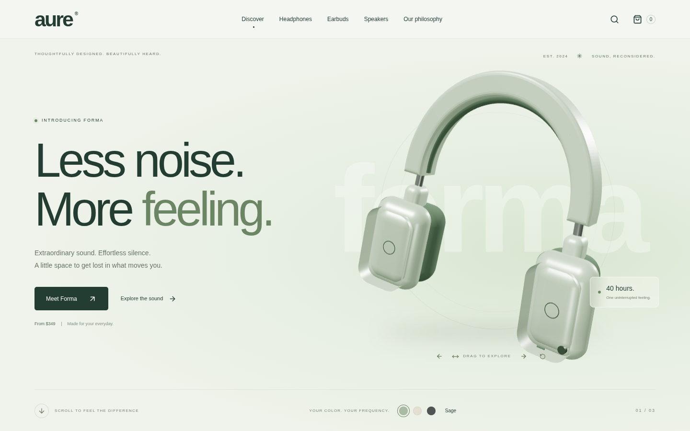
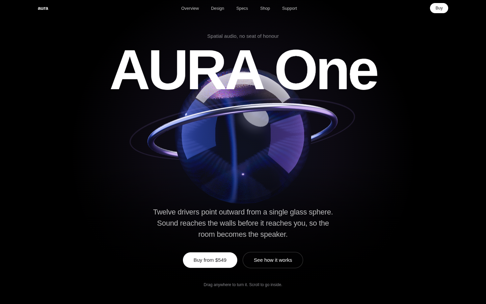
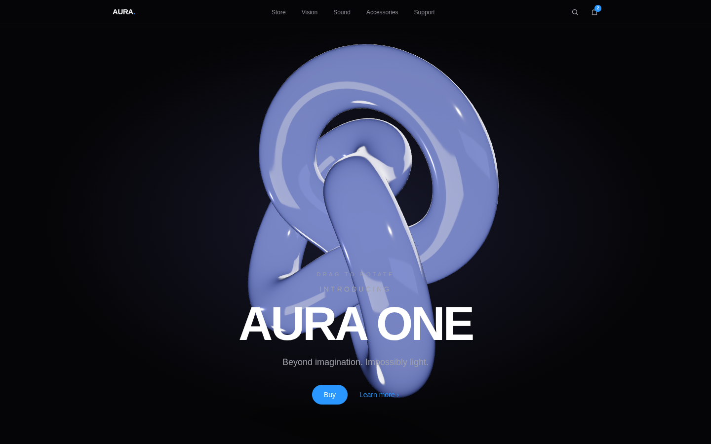
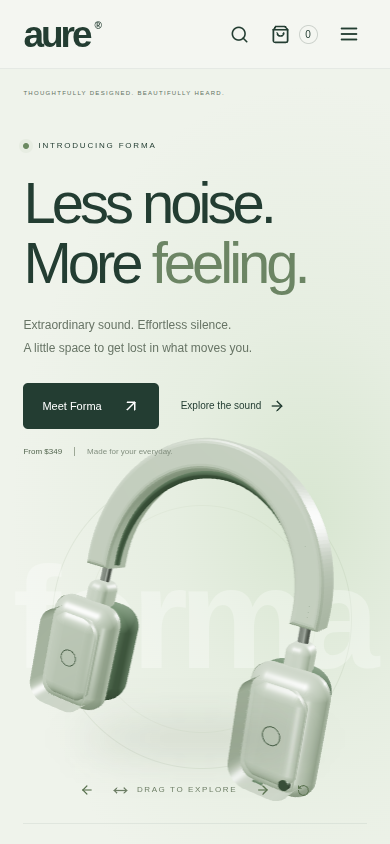
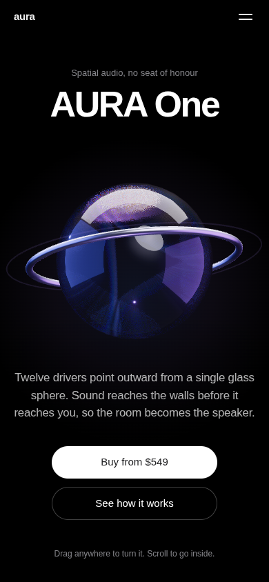
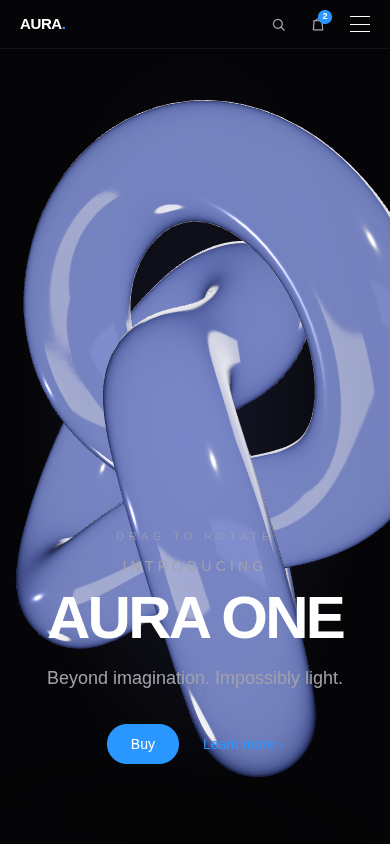

<div align="center">

# One Prompt, Three Models

**The same front-end brief, handed once to Claude, Kimi K2 and OpenAI Codex.**
Three complete builds. No follow-up turns. No clarifying questions. Deployed unmodified.

[](https://hamzahossainX.github.io/Comparison/)
[](https://docs.pmnd.rs/react-three-fiber)
[](https://www.typescriptlang.org/)
[](https://tailwindcss.com/)
[](https://www.framer.com/motion/)

### 🔗 [**hamzahossainX.github.io/Comparison**](https://hamzahossainX.github.io/Comparison/)

| | 🥇 [**Codex**](https://hamzahossainX.github.io/Comparison/codex/) | 🥈 [**Claude**](https://hamzahossainX.github.io/Comparison/claude/) | 🥉 [**Kimi K2**](https://hamzahossainX.github.io/Comparison/kimi-k3/) |
|:--|:--|:--|:--|
| **Score** | **6.5** / 10 | **6.0** / 10 | **5.2** / 10 |
| **Verdict** | The One That Works | The One With the Highest Ceiling | The Safe One |
| **Source** | [`Codex/`](./Codex) | [`Claude/`](./Claude) | [`KIMI-K3/`](./KIMI-K3) |

</div>

---

## The builds

<table>
<tr>
<td width="33%" align="center"><b>🥇 Codex</b><br><sub>Vite 7 · React 19 · 670 LOC</sub></td>
<td width="33%" align="center"><b>🥈 Claude</b><br><sub>Next.js 14 · React 18 · 1,615 LOC</sub></td>
<td width="33%" align="center"><b>🥉 Kimi K2</b><br><sub>Next.js 14 · React 18 · 964 LOC</sub></td>
</tr>
<tr>
<td><a href="https://hamzahossainX.github.io/Comparison/codex/"></a></td>
<td><a href="https://hamzahossainX.github.io/Comparison/claude/"></a></td>
<td><a href="https://hamzahossainX.github.io/Comparison/kimi-k3/"></a></td>
</tr>
<tr>
<td align="center"></td>
<td align="center"></td>
<td align="center"></td>
</tr>
</table>

> Every screenshot is captured from the real static-export output served under its deployment
> subpath — not from a dev server — so what you see is what deploys.

---

## 🥇 1st — Codex · *The One That Works*

> The least atmospheric build and the only one whose headline interactions all fire in the
> shipped artefact — plus the only one with tests.

A 670-line Vite 7 + React 19 storefront, built almost entirely in one 152-line `App.tsx` with
380 lines of hand-written CSS. Its distinguishing move is that **the 3D object is the product**:
`Scene.tsx:14-21` extrudes a two-arc `Shape` into a bevelled headband and assembles it with a
half-torus gasket, `RoundedBox` cups and pads, cylinder hinge arms and an asymmetric right-cup
button — then makes it a configurator, with three finish swatches recolouring the live WebGL
materials and keyboard nudge/reset buttons so the interaction is not mouse-gated.

It is the only build whose render loop actually stops, the only one with a test suite, and the
only one whose typecheck gates the build.

**Strengths**
- Procedurally modelled headphones that read as the product being sold, with an extruded custom-`Shape` headband rather than a spinning primitive — `src/Scene.tsx:14-21`
- The only build whose GPU idles: `frameloop="demand"` with `invalidate` wired to the scroll MotionValue and `active={inView && !modal}` — `src/Scene.tsx:22-34`
- Real product depth — finish configurator, category filtering with `AnimatePresence popLayout`, search dialog, cart with quantity caps, `localStorage` persistence and a demo checkout
- The only tested build: 70 lines of Playwright driven by accessible names, covering overflow, page errors, focus return, reduced motion and corrupt persisted state

**Weaknesses**
- **Inverts the brief's dark theme entirely** — light sage-on-paper (`#233d32` on `#f7f8f4`), with dark used only inside one section
- Roughly 24 text declarations fall below WCAG AA 4.5:1, including hero body copy at 4.15:1
- Unreviewable file shape: line 142 of `App.tsx` is 1,654 characters holding the entire cart
- Tailwind 4 is installed and wired through the Vite plugin but renders exactly **one** utility class

**Best for** — a product page that must work end to end on day one and survive a second
contributor: commerce flows, configurators, anything where a broken interaction costs more than
a dull one.

---

## 🥈 2nd — Claude · *The One With the Highest Ceiling*

> The most sophisticated system in the comparison, undone by two CSS lines that kill both of its
> headline interactions in the shipped build.

A 1,615-line Next.js 14 build across 19 files with real `three/` vs `ui/` vs section layering,
exact-pinned dependencies, and a design language expressed as Tailwind tokens. Its 3D is the
most materially developed of the three: a 5-subdivision icosahedral glass shell under
`MeshTransmissionMaterial` with chromatic aberration, distortion, IOR 1.42 and attenuation
colour, lit by a hand-built five-`Lightformer` studio baked at `frames={1}` so no HDRI is
fetched at runtime. The choreography is genuinely authored rather than parameterised —
`AuraModel.tsx:28-92` is a three-chapter pose storyboard mapping scroll to position, scale,
tilt, spin and ring separation.

Then it breaks itself twice. **Both failures were reproduced in a real browser against the
built export for this README:**

```
① The pinned showcase does not pin
   overflow-x:hidden on BOTH html and body (globals.css:21, :26) makes body a
   scroll container and kills position:sticky.
   Measured mid-section: sticky pane sits at -437px instead of 0 — it scrolls away.
   Result: all three chapters cross-fade inside the first viewport, then ~2,500px
   of empty black where the centrepiece should be.

② Drag-to-rotate never fires
   <main class="relative z-10"> sits over a fixed z-0 canvas whose sections are not
   pointer-events-none.
   Measured: document.elementFromPoint(centre) returns SECTION#hero, never the canvas.
   Result: PresentationControls is dead code, and the hero's own on-screen line
   "Drag anywhere to turn it" is false.
```

**Strengths**
- The deepest material work in the set — transmission glass with chromatic aberration and attenuation over a hand-built Lightformer studio, with no CDN HDRI fetch — `src/components/three/Studio.tsx:23-68`
- A declarative three-chapter pose function treating scroll as a storyboard, with a ring-detach beat — `src/components/three/AuraModel.tsx:28-92`
- The only real type system here: a fluid `clamp()` display scale, a disciplined four-colour palette, one easing curve shared between CSS and JS
- Best-organised codebase — 19 files with genuine module boundaries, path aliases, exact-pinned deps, and a rationale comment on nearly every non-obvious decision

**Weaknesses**
- The pinned centrepiece does not pin *(verified above)*
- Drag-to-rotate never fires *(verified above)*
- No `frameloop` control, so `MeshTransmissionMaterial`'s extra full-scene render-target pass keeps running through the spec section, grid and footer
- Zero tests, no error boundary, and the exported HTML ships `opacity:0` on every body element — any rAF stall renders the page black below the nav

**Best for** — a team that will read and extend the source. The architecture, token system and 3D
rig are worth inheriting, provided someone runs the page in a browser first.

---

## 🥉 3rd — Kimi K2 · *The Safe One*

> Competent, coherent, intact on desktop — and the least memorable, with accessibility
> effectively absent and its one advertised interaction broken on touch.

A 964-line Next.js 14 build across 9 files, structured as two full-height sticky scroll-scrub
chapters over real WebGL: a transmissive torus knot with inertial drag in the hero, and a metal
`RoundedBox` whose material and point light lerp through per-chapter accent colours. It gets the
hard architectural decision right — the Framer Motion `scrollYProgress` object is passed as a
prop into the R3F tree and read imperatively via `progress.get()` inside `useFrame`, so scroll
drives 3D at frame rate with **zero React re-renders**.

Its ceiling is set by the object: a torus knot is pure abstraction where the copy is selling a
device, and every form is a stock primitive.

**Strengths**
- Genuine glass — `transmission: 1` with thickness 1.1, IOR 1.45, clearcoat and a separate `attenuationColor`/`attenuationDistance` pair, under a hand-authored four-Lightformer rig
- Scroll crosses the React/WebGL boundary correctly — the MotionValue is passed as a prop and read with `.get()` inside `useFrame`, never subscribed with `useState`
- Windowed chapter choreography computed from a shared segment width, so chapters hand off on one timeline
- A data-driven accent system where one hex per chapter colours the copy, the card gradient, the glow, the 3D material and a point light simultaneously

**Weaknesses**
- **Accessibility is effectively absent**: three `aria-label`s in the whole `src` tree, zero `prefers-reduced-motion` handling against 540vh of scroll hijack, and `header`/`footer` nested inside `main` which voids the `banner` and `contentinfo` landmarks
- The advertised drag is broken three ways — no `pointercancel` handler latches it on after the first mobile scroll, velocity is overwritten rather than accumulated, and a fixed `0.93` per-frame decay makes the feel differ at 144Hz
- The hero's `useScroll` offset tops out around 0.545, so **roughly 45% of the signature zoom is computed and never seen**
- Two always-on WebGL contexts with no visibility gating, including one offscreen

**Best for** — a scroll-narrative page where clean architecture and an intact desktop journey
matter more than depth of interaction or a phone audience.

---

## Full comparison

| | Claude | Kimi K2 | Codex |
|:--|:--|:--|:--|
| **3D implementation** | Transmission glass, 5-Lightformer baked studio, detaching ring; no GLSL, no model | Transmission torusKnot + metal RoundedBox, 4-Lightformer rig; all stock primitives | Procedurally modelled headphones (extruded `Shape` headband); `meshStandardMaterial`, no env map |
| **Animation** | Authored 3-chapter pose storyboard — but the pin is broken, so it plays in one viewport | Two sticky scrubs with windowed chapter handoff; ~45% of hero range never reached | One MotionValue drives CSS, WebGL and a progress bar; unsticks under reduced motion |
| **Interactivity** | Drag advertised, never fires; dead "Add to bag", 21 dead footer links | Drag works on desktop, latches on touch; inert Buy buttons, hardcoded cart badge | Finish configurator, filters, search, cart, checkout, keyboard nudge controls |
| **Visual design** | Dark, editorial, disciplined 4-colour palette + one accent; best composed hero | Restrained dark, data-driven accents, entirely imageless CSS art | Confident light sage/paper composition — but inverts the brief's dark requirement |
| **Typography** | Fluid `clamp()` display scale, real type tokens | SF Pro Display named with no webfont — falls back to Arial off Apple hardware | Helvetica Neue/Arial with `font-synthesis:none`; 450/650 weights collapse off macOS |
| **Responsiveness** | Breakpoints in the 3D itself; zero overflow at 390px, but sticky failure strands mobile | 17 `md:`, one `sm:`, one `lg:` — effectively two-state | Four real re-layout bands, order swaps, `100svh`, overflow asserted in CI |
| **Accessibility** | Reduced motion in CSS and JS, skip link (mistargeted), 4 contrast failures | 3 aria attributes total, no reduced-motion path, landmarks voided by nesting | Native `dialog` focus trap, `aria-live`, `aria-pressed`, skip link — ~24 contrast failures |
| **Performance** | Dynamic import, dpr cap, no HDRI — but `frameloop` always + transmission FBO through the footer | Two always-on contexts, ContactShadows at `frames=Infinity` | `frameloop="demand"` gated on `inView` and modal; 873 KB three chunk on first paint |
| **Architecture** | 19 files, three/ui/section layering, typed data, pinned deps | 9 files, one boolean of state, typed content module; no Suspense or memo | One 152-line `App.tsx` with 1,650-char JSX lines; error boundary + validated rehydration |
| **Testing** | None | None | 70-line Playwright suite |
| **LOC** | 1,615 | 964 | 670 |
| **Overall** | **6.0** — highest ceiling, lowest floor | **5.2** — coherent, conservative, thin | **6.5** — least atmospheric, most functional |

### Category winners

| Category | Winner | Why |
|:--|:--|:--|
| Brief adherence | **Claude** | The only build that kept the dark, immersive treatment the brief asked for and backed it with real tokens |
| 3D depth | **Claude** | A three-way tie on corrected scores, decided on material work — transmission glass with chromatic aberration |
| Animation craft | **Codex** | Claude authored richer choreography but it does not pin in the shipped build |
| Visual design | **Claude** | Tied with Codex, decided by system rather than frame — a fluid type scale and a disciplined palette |
| Code quality | **Claude** | Genuine module boundaries across 19 files, typed data, exact-pinned dependencies |
| Responsiveness | **Codex** | Four breakpoint bands that genuinely re-layout, including a sticky story that collapses to stacked flow |
| Accessibility | **Codex** | The platform's own focus trap via `dialog.showModal()`, `aria-live`, `aria-pressed`, a working skip link |
| Performance | **Codex** | The only build where the render loop stops |

### Independently measured

Numbers taken directly from the built output, not from any model's claims.

| Measurement | Claude | Kimi K2 | Codex |
|:--|--:|--:|--:|
| JS shipped (gzip, all chunks) | 506 KB | 477 KB | **346 KB** |
| R3F frameloop | `always` | `always` | **`demand`** |
| Files handling `prefers-reduced-motion` | **5** | 0 | 2 |
| `focus-visible` declarations | 1 | 0 | **2** |
| Distinct ARIA attributes used | 4 | 1 | **7** |
| End-to-end tests | 0 | 0 | **70 lines** |
| Static export under a subpath | ✅ | ✅ | ✅ |

---

## The prompt

All three builds came from **one prompt, issued once**, with no follow-up turns. It is
reproduced verbatim in **[`docs/PROMPT.md`](docs/PROMPT.md)**, along with a refined v2 rewrite.

The brief asked for *"a complete, premium, and highly interactive portfolio website for a 3D
artist"* — dark, sleek, minimalist, immersive, with a hero, a portfolio gallery, an about
section and a contact form.

**All three returned a product showcase for a fictional audio brand instead.** None ships a
contact form, an about section or a gallery of an artist's work. None loads a placeholder 3D
model; every object on screen is built from three.js primitives or authored geometry in code.

That the divergence is *unanimous* points at the prompt rather than at any one model. "Premium,
immersive, 3D, dark, Awwwards-winning" is a far louder signal than "portfolio for a 3D artist",
and the strongest training examples of that aesthetic are product launch pages. Asked for a vibe
and a structure at once, all three optimised for the vibe.

Because that divergence is identical across all three, it separates none of them — so the
ranking above scores what does: the mandated stack, the immersive aesthetic, the interactive 3D
hero, hover and transition craft, responsiveness, accessibility and performance.
[`docs/PROMPT.md`](docs/PROMPT.md) explains what v2 changes to close that gap.

---

## How the ranking was produced

1. **Independent review** — one reviewer per codebase, reading every source file and scoring
   eight dimensions with a `file:line` citation behind every claim.
2. **Adversarial verification** — a second pass per codebase whose job was to *refute* the
   first, re-opening the cited lines and hunting for missed defects. It corrected scores
   downward in 19 of 24 cases.
3. **Three judges, three lenses** — craft, visitor experience, and engineering, each ranking all
   three from the reviews plus corrections.
4. **Synthesis** — merged into the ranking above.
5. **Manual verification** — the load-bearing claims were reproduced by hand in a real browser
   against the built exports, and every number in *Independently measured* was taken from the
   build output directly.

**Where the judges disagreed.** All three lenses put Codex first, and none of them liked it
most. Craft and Engineering ranked Claude second on the strength of its material work and module
boundaries; Experience dropped it to **third**, because the two interactions it stakes the visit
on are both dead in the shipped artefact. That disagreement is real and worth stating plainly:
*judged on source intent Claude beats Kimi K2 comfortably; judged on what a visitor actually
receives, it does not.*

---

## Repository layout

```
.
├── Claude/              Claude's build      — Next.js 14, React 18, Tailwind 3
├── KIMI-K3/             Kimi K2's build     — Next.js 14, React 18, Tailwind 3
├── Codex/               Codex's build       — Vite 7, React 19, Tailwind 4, Playwright
├── docs/
│   ├── PROMPT.md        the shared prompt, verbatim, plus a refined v2
│   ├── landing/         the landing page published at the Pages root
│   └── previews/        screenshots captured from the built exports
├── scripts/preview.sh   build all three and serve them exactly as Pages does
└── .github/workflows/   builds all three and deploys them to one Pages site
```

## Running locally

Each build is independent, with its own lockfile and its own `node_modules`:

```bash
cd Claude && npm install && npm run dev     # or KIMI-K3, or Codex
```

To reproduce the deployed site — all three under their real subpaths, with the same
asset-URL verification CI runs:

```bash
./scripts/preview.sh
```

Then open <http://localhost:8099/Comparison/>.

## Deployment

All three are published to a single GitHub Pages site by
[`.github/workflows/deploy.yml`](.github/workflows/deploy.yml).

The three sites share one domain, so each is served from its own subpath and every asset URL has
to be rewritten to match — a root-absolute `/_next` or `/assets` reference 404s once the site is
not at the domain root. All three builds therefore share one contract, **`PAGES_BASE_PATH`**:
set it and the build switches to a fully static export with its URLs rewritten; leave it unset
and `dev` and `build` behave exactly as they always did. The workflow is the only place it is
set.

Two per-stack details the contract absorbs:

- **Next.js wants `basePath` without a trailing slash; Vite wants `base` with one.** The
  workflow passes each the form it expects.
- **A static export has no server to run the Next.js image optimiser on**, so
  `images.unoptimized` is forced on when exporting.

The version split between the builds — React 18 vs 19, Tailwind 3 vs 4, Next.js vs Vite — is
deliberate and is *preserved*, not resolved. Each project is installed with `npm ci` inside its
own directory, so nothing is hoisted and no dependency is shared. The workflow then asserts every
build emitted an entry point and that no root-absolute asset URLs survived, and fails the deploy
rather than publishing a broken site.

---

## Takeaway

The three models failed and succeeded in different places, and the pattern is consistent enough
to be worth naming.

**Claude** produced the most *designed* artefact — the best materials, the only real type system,
the cleanest module boundaries — and shipped it without ever opening it in a browser, so two
one-line CSS mistakes silently disabled both of its headline interactions while its own README
continued to describe them.

**Kimi K2** produced the most conservative build, got the hard architectural pattern right, and
then stopped: stock primitives, a scroll range it never reaches, three aria attributes in the
whole tree, and nothing below the fold but staggered fade-ups.

**Codex** produced the least atmospheric site and the only one that works, because it is the only
one that wrote the harness that would have caught its own mistakes — and its remaining defects
(an inverted theme, a palette-wide contrast failure, a 1,650-character JSX line) are the kind a
reviewer can see, not the kind that hide until someone scrolls.

---

<div align="center">
<sub>Each build is the model's first and only response to the prompt, committed as generated.
The only changes made were the deployment configuration and this documentation.</sub>
</div>
